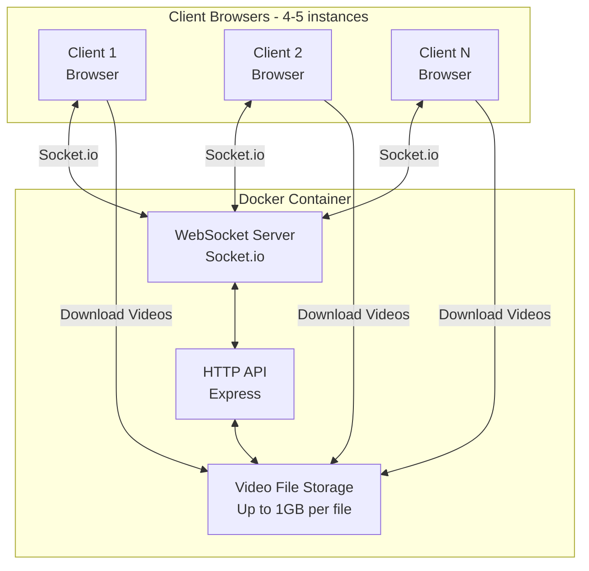
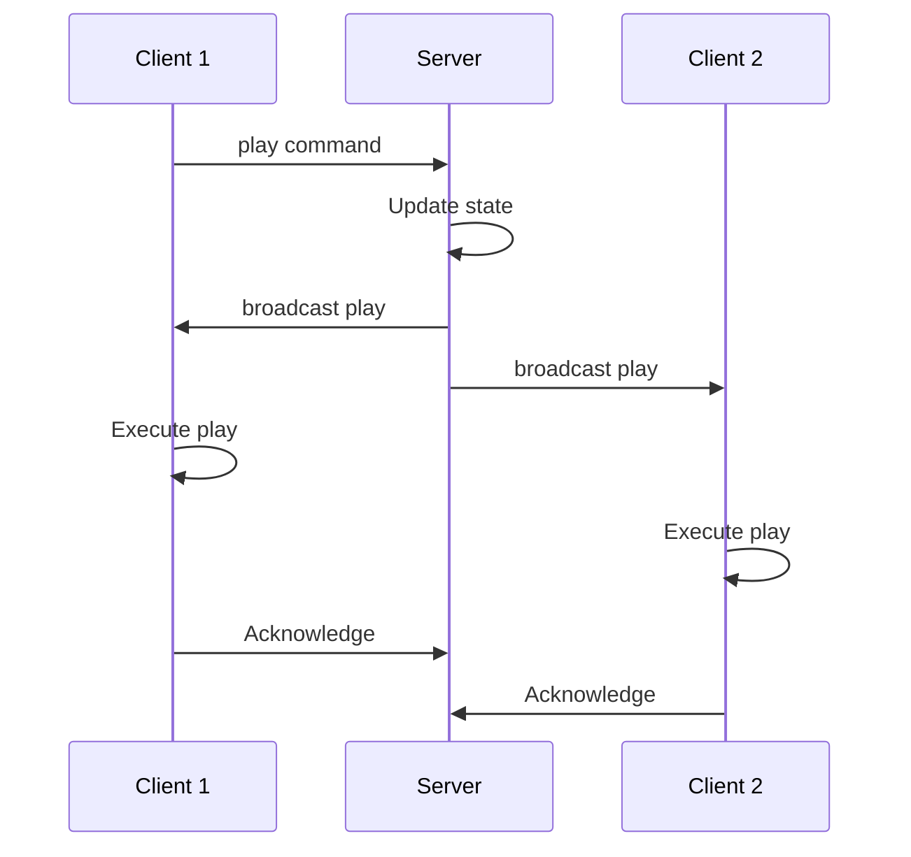
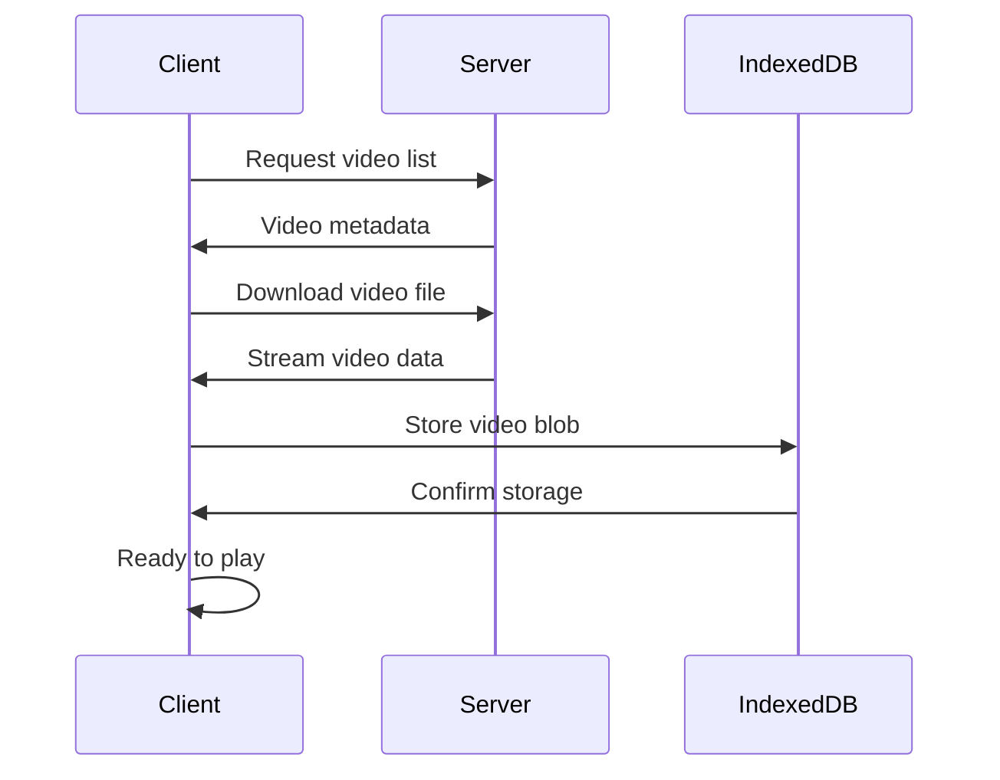

# Architecture

## System Overview



## Project Structure

```
lcars/
├── client/                 # React + TypeScript frontend
│   ├── src/
│   │   ├── components/    # Reusable UI components
│   │   ├── themes/        # Theme definitions (LCARS, custom)
│   │   ├── hooks/         # React hooks (socket, video sync)
│   │   ├── services/      # API communication layer
│   │   ├── stores/        # State management
│   │   └── App.tsx        # Main application
│   ├── public/            # Static assets
│   └── package.json
│
├── server/                # Node.js + Express backend
│   ├── src/
│   │   ├── socket/        # Socket.io handlers
│   │   ├── api/           # REST API routes
│   │   ├── storage/       # Video file management
│   │   └── server.ts      # Main server file
│   ├── videos/            # Video storage directory
│   └── package.json
│
├── docker/                # Docker configuration
│   ├── Dockerfile
│   └── docker-compose.yml
│
├── design/                # Design reference files
│   └── lcars-*.png        # Star Trek LCARS references
│
└── docs/                  # Additional documentation
```

## Key Architectural Decisions

### 1. Client-Server Architecture
- **Server**: Single Docker container running Node.js
- **Clients**: Pure browser-based (no installation required)
- **Communication**: Bidirectional real-time via Socket.io

### 2. Video Synchronization Strategy
**Pre-download Approach:**
1. Client requests video list from server
2. Client downloads video file to browser storage (IndexedDB/Cache API)
3. Server broadcasts play/pause/seek commands
4. All clients execute commands synchronously using timestamps

**Synchronization Protocol:**
```javascript
// Server sends
{ 
  action: 'play',
  videoId: 'video1',
  timestamp: 1234567890,
  position: 0.0
}

// Client calculates:
const delay = Date.now() - timestamp
const adjustedPosition = position + (delay / 1000)
```

### 3. Peer Control System
- **No master/slave**: Any connected client can send control commands
- **Conflict resolution**: Last command wins (timestamp-based)
- **State broadcasting**: Server maintains authoritative state and broadcasts to all

### 4. Theme System
**Theme Structure:**
```typescript
interface Theme {
  id: string
  name: string
  colors: {
    primary: string
    secondary: string
    accent: string
    background: string
    text: string
  }
  fonts: {
    primary: string
    display: string
  }
  components: {
    Button: ComponentTheme
    Panel: ComponentTheme
    Display: ComponentTheme
  }
}
```

**Themes:**
- LCARS (Star Trek TNG) - Primary theme
- LCARS Voyager variation
- Generic sci-fi themes (extendable)

### 5. Component Architecture

**Component Hierarchy:**
```
App
├── ThemeProvider
├── SocketProvider
└── Layout
    ├── ControlPanel (conditional)
    ├── MainDisplay
    │   ├── VideoPlayer
    │   ├── DataDisplays
    │   └── InteractiveButtons
    └── StatusBar
```

## Data Flow

### Video Control Flow


### Video Download Flow


## Critical Implementation Paths

### Path 1: Project Setup
1. Initialize monorepo structure
2. Configure TypeScript for both client and server
3. Set up Docker configuration
4. Create basic dev environment

### Path 2: Core Communication
1. Implement Socket.io server
2. Create socket client wrapper
3. Build event handling system
4. Add connection state management

### Path 3: Video System
1. Implement video file storage API
2. Create video download mechanism (IndexedDB)
3. Build synchronized playback controls
4. Add progress tracking and seeking

### Path 4: UI Framework
1. Set up theme provider
2. Create base component library
3. Implement LCARS styling
4. Add touch event handling

### Path 5: Production Readiness
1. Docker containerization
2. Production builds
3. Error handling and recovery
4. Performance optimization

## Technology Integration Points

### Socket.io Events
```typescript
// Client -> Server
'control:play' | 'control:pause' | 'control:seek' | 'control:stop'
'video:request' | 'video:progress'
'client:ready' | 'client:error'

// Server -> Client
'control:execute' | 'state:update'
'video:metadata' | 'client:connected' | 'client:disconnected'
```

### API Endpoints
```
GET  /api/videos           - List available videos
GET  /api/videos/:id       - Download video file
POST /api/videos           - Upload new video
GET  /api/clients          - List connected clients
GET  /api/state            - Current system state
```

## Scalability Considerations

**Current Target**: 4-5 clients, LAN only
**Future Expansion Paths**:
- Increase client limit (10-20) - requires testing
- Add multiple "rooms" for different sets
- Cloud deployment option
- Remote control API for external systems

## Security Notes

Since this is LAN-only for video production:
- **No authentication required** initially
- **No HTTPS** required (local network)
- **No data encryption** on transport
- Focus on reliability and performance over security

If internet deployment becomes needed:
- Add token-based authentication
- Implement HTTPS/WSS
- Add rate limiting
- Sanitize all inputs