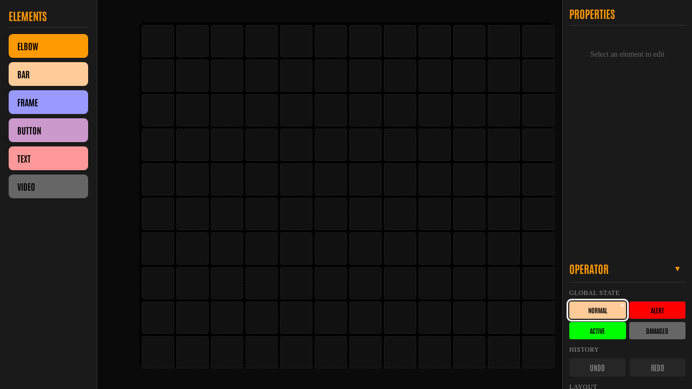
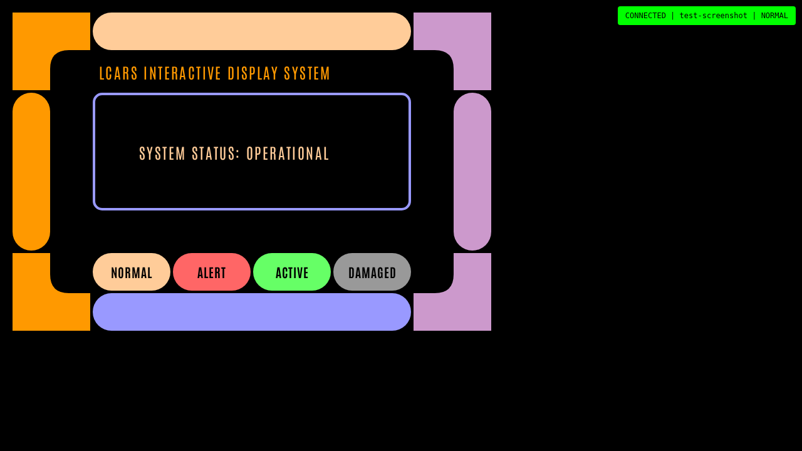

# LCARS Interactive Display System

<p align="center">
  <strong>A WebSocket-based client-server system for creating and displaying interactive LCARS-style sci-fi interfaces for video production.</strong>
</p>

<p align="center">
  <a href="#features">Features</a> •
  <a href="#screenshots">Screenshots</a> •
  <a href="#quick-start">Quick Start</a> •
  <a href="#architecture">Architecture</a> •
  <a href="#api-reference">API</a> •
  <a href="#testing">Testing</a>
</p>

---

## Overview

A purpose-built solution for video productions requiring sci-fi interface displays that combines:

- **Real-time synchronization** across 6-15 simultaneous browser displays
- **Simple operation** for non-technical crew with operator trigger buttons
- **Reliable actor interaction** with visual feedback on touchscreen displays
- **Offline resilience** for on-set reliability
- **Visual design tools** for rapid layout iteration

---

## Features

### Display Elements

| Element    | Description                | Styling Options                           |
| ---------- | -------------------------- | ----------------------------------------- |
| **Elbow**  | L-shaped corner pieces     | TL/TR/BL/BR, asymmetric widths, SVG paths |
| **Bar**    | Horizontal/vertical bars   | Round/square/pointed end caps             |
| **Frame**  | Rectangular border         | Border width, corner style                |
| **Button** | Touch-interactive buttons  | Label, corner styles, 60px touch targets  |
| **Text**   | Static text labels         | Font size, color, alignment               |
| **Video**  | WebSocket-controlled video | Play/pause/seek/load, fit modes           |

### Global States

Elements respond to 4 global states with color changes and animations:

| State       | Color            | Animation |
| ----------- | ---------------- | --------- |
| **Normal**  | Orange (#ff9900) | Static    |
| **Alert**   | Red (#ff0000)    | Pulse     |
| **Active**  | Green/Blue       | Highlight |
| **Damaged** | Purple           | Flicker   |

### Builder Mode

- **Drag-drop canvas** with 12-column grid snapping
- **Element palette** for adding new components
- **Property panel** for editing element properties
- **10-level undo/redo** for mistake recovery
- **Save/load layouts** as JSON files

### Operator Panel

- **4 large trigger buttons** for state changes
- **Real-time state indicator** showing current system state
- **Connected screens list** for monitoring display clients

---

## Screenshots

### Builder Interface



_The drag-drop layout editor with palette, canvas, and property panel._

### Display Client



_Live display client showing an LCARS-style interface layout._

### How to Capture Screenshots

Run the automated screenshot test to regenerate images:

```bash
pnpm test:e2e tests/e2e/screenshot.spec.ts
```

**Manual capture:**

1. Start the development server: `pnpm dev`
2. Open builder: **http://localhost:5176/builder**
3. Use browser screenshot or `Shift+Ctrl+S` (Chrome)
4. Save to `docs/screenshots/` directory

---

## Quick Start

### Prerequisites

- Node.js 24 LTS
- pnpm 9+

### Installation

```bash
# Clone the repository
cd interactive-displays

# Install dependencies
pnpm install

# Start development servers
pnpm dev
```

### Access Points

| URL                           | Purpose                                               |
| ----------------------------- | ----------------------------------------------------- |
| http://localhost:5176         | Display mode (add `?screen=bridge` for named screens) |
| http://localhost:5176/builder | Layout builder with operator panel                    |
| http://localhost:3010         | Server (health check at /health)                      |

### Creating Your First Layout

1. Open **http://localhost:5176/builder**
2. Drag elements from the palette onto the canvas
3. Click elements to select and edit properties in the panel
4. Click **Save** to persist the layout
5. Open **http://localhost:5176** to see the live display

---

## Architecture

```
┌───────────────────────────────────────────────────────┐
│                      SERVER                            │
│  ┌─────────────┐  ┌─────────────┐  ┌──────────────┐  │
│  │ Layouts     │  │ globalState │  │ Socket.io    │  │
│  │ /data/*.json│  │ (string)    │  │ (broadcast)  │  │
│  └─────────────┘  └─────────────┘  └──────────────┘  │
│  Node.js 24 LTS / Fastify / TypeScript               │
└───────────────────────────────────────────────────────┘
                          │
              Socket.io (single namespace)
                          │
     ┌────────────────────┴────────────────────┐
     ▼                                          ▼
┌─────────────────────┐          ┌─────────────────────┐
│   APP (Display)     │          │   APP (Builder)     │
│   /?screen=bridge   │          │   /builder          │
│                     │          │                     │
│  Shows layout       │          │  Drag-drop editor   │
│  Responds to state  │          │  Operator buttons   │
└─────────────────────┘          └─────────────────────┘
      × 6-15 screens                   × 1 editor
```

### Project Structure

```
lcars/
├── packages/
│   ├── server/              # Fastify + Socket.io
│   │   ├── src/
│   │   │   ├── index.ts    # Entry point
│   │   │   ├── socket.ts   # WebSocket handlers
│   │   │   ├── layouts.ts  # JSON file CRUD
│   │   │   └── types.ts    # Shared types
│   │   └── data/layouts/   # Layout JSON files
│   │
│   └── app/                 # React 19 + Vite
│       ├── src/
│       │   ├── components/ # Elbow, Bar, Frame, Button, Text, Video
│       │   ├── context/    # DisplayContext (state management)
│       │   ├── display/    # DisplayScreen, LayoutRenderer
│       │   └── builder/    # BuilderPage, Canvas, Palette, PropertyPanel
│       └── theme.css        # LCARS theme variables
│
├── data/layouts/            # Saved layouts (gitignored)
├── design/                   # Design reference images (inspiration)
├── docs/
│   └── screenshots/          # Application screenshots
└── tests/                    # E2E Playwright tests
```

---

## API Reference

See [`docs/API.md`](docs/API.md) for complete WebSocket API documentation.

### Socket Events

```typescript
// Server → Client
socket.emit('state', globalState) // State changed
socket.emit('layout', layout) // Layout update
socket.emit('videoCommand', command) // Video control

// Client → Server
socket.emit('identify', screenId) // Register display
socket.emit('stateChange', newState) // Operator triggers state
socket.emit('saveLayout', layout) // Save layout
socket.emit('videoState', state) // Report video status
```

### Global States

```typescript
type GlobalState = 'normal' | 'alert' | 'active' | 'damaged'
```

### Layout Data Model

```typescript
interface Layout {
  id: string
  name: string
  elements: LayoutElement[]
}

interface LayoutElement {
  id: string
  type: 'elbow' | 'bar' | 'frame' | 'button' | 'text' | 'video'
  col: number // Grid column (0-11)
  row: number // Grid row
  colSpan: number // Width in columns
  rowSpan: number // Height in rows
  color: string // Element color

  // Type-specific properties...
}
```

---

## Testing

### Automated Tests

Run connection and performance tests:

```bash
cd packages/app && pnpm exec tsx src/test-connections.ts
```

**Results:**

- Server accepts 20 WebSocket connections ✅
- State propagation: max 6ms, avg 4ms ✅

### Manual Testing

See [`docs/ACCEPTANCE-TESTING.md`](docs/ACCEPTANCE-TESTING.md) for the complete testing checklist:

- [ ] Display elements render correctly
- [ ] Builder drag-drop operations
- [ ] Operator panel state synchronization
- [ ] Layout persistence
- [ ] Touch feedback < 50ms
- [ ] 60fps animations
- [ ] Auto-reconnect on disconnect
- [ ] 10-level undo
- [ ] Browser compatibility (Chrome, Firefox, Safari)
- [ ] No console errors

### End-to-End Tests

```bash
pnpm test:e2e  # Run Playwright tests
```

---

## Tech Stack

| Category            | Technology               |
| ------------------- | ------------------------ |
| **Runtime**         | Node.js 24 LTS           |
| **Server**          | Fastify + Socket.io      |
| **Frontend**        | React 19 + Vite          |
| **State**           | React Context            |
| **Drag-Drop**       | @dnd-kit/core            |
| **Routing**         | react-router-dom 6       |
| **Language**        | TypeScript (strict mode) |
| **Linting**         | Oxlint (Rust-based)      |
| **Testing**         | Vitest + Playwright      |
| **Package Manager** | pnpm (monorepo)          |

---

## Roadmap

### Completed (v1.0)

- [x] Server with WebSocket broadcasting
- [x] 5 core display elements
- [x] Drag-drop builder
- [x] Operator panel with state triggers
- [x] Layout persistence (JSON files)
- [x] Video element with WebSocket control
- [x] Asymmetric elbows (authentic LCARS styling)

### Planned (v2.0)

- Number Display (animated counting)
- Status Indicator (blinking lights)
- Bar Graph (animated values)
- Element Registry Pattern (easier extensibility)
- Service Worker offline caching
- Multiple theme support

### Future (v3.0+)

- Interactive elements (Slider, Toggle, Data grid)
- Scripted sequences (timeline animations)
- Audio support (alert sounds)
- Docker deployment
- REST API + MCP tools

---

## Success Metrics

| Metric             | Target                                               |
| ------------------ | ---------------------------------------------------- |
| **Reliability**    | Zero unplanned display outages during takes          |
| **Responsiveness** | All state changes visible within 100ms               |
| **Usability**      | Non-technical crew can operate within 5 minutes      |
| **Flexibility**    | New screen layout can be created in under 30 minutes |

---

## Documentation

| Document                                                                                                                                     | Purpose                                       |
| -------------------------------------------------------------------------------------------------------------------------------------------- | --------------------------------------------- |
| [`docs/plans/2026-02-04-feat-lcars-interactive-display-system-plan.md`](docs/plans/2026-02-04-feat-lcars-interactive-display-system-plan.md) | Complete architecture and implementation plan |
| [`docs/API.md`](docs/API.md)                                                                                                                 | WebSocket API reference                       |
| [`docs/ACCEPTANCE-TESTING.md`](docs/ACCEPTANCE-TESTING.md)                                                                                   | Testing checklist and procedures              |
| [`docs/team-roles.md`](docs/team-roles.md)                                                                                                   | Team skills and responsibilities              |
| [`docs/solutions/`](docs/solutions/)                                                                                                         | Architecture decisions and patterns           |

---

## License

MIT License - See project root for details.

---

## Credits

- LCARS design inspiration: [lcars.org.uk](https://www.lcars.org.uk/)
- LCARS Big Picture Reference: [elonn.com](https://elonn.com/big-picture.html)
